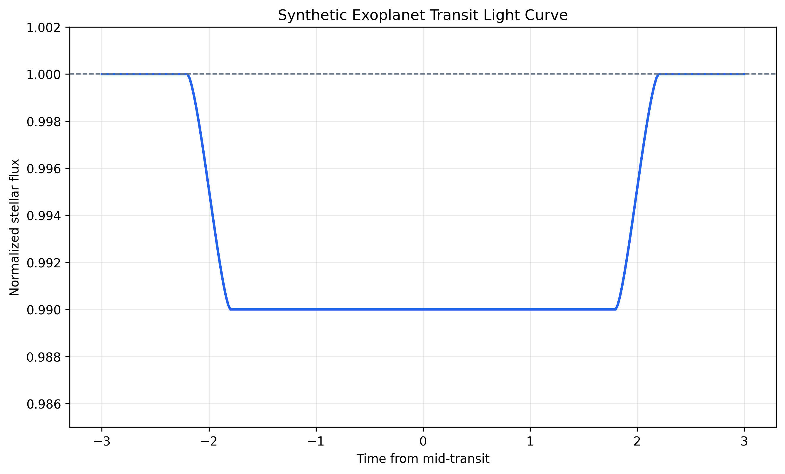
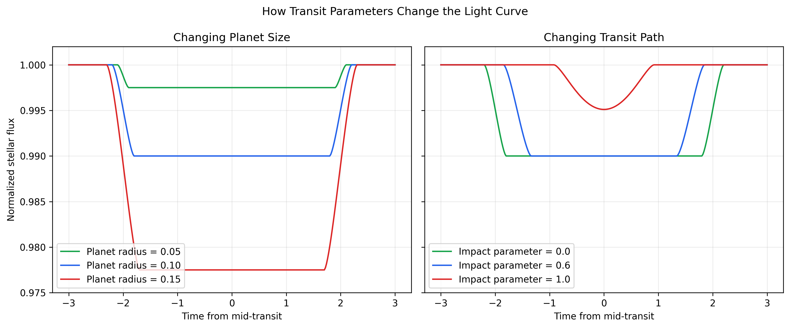

# Exoplanet Transit Study

This small study models how an exoplanet blocks part of its star's light
during a transit. It uses synthetic data and simple circle geometry so the
connection between the model and the light curve remains easy to explain.

## Scientific Question

How do planet size and the path across the star change the observed transit
light curve?

## Simplified Model

The star and planet are represented as circular disks. The planet is opaque,
and the star has uniform brightness. The unobscured stellar flux is normalized
to `1.0`.

For a central transit, the maximum fraction of blocked light is:

```text
transit depth = (planet radius / star radius)^2
```

At any other position, the model calculates the overlapping area of the two
circles. The normalized flux is:

```text
flux = 1 - overlap area / star area
```

The projected separation between the star and planet is modeled as:

```text
separation = sqrt((transit speed * time)^2 + impact parameter^2)
```

Time is measured relative to the middle of the transit. The impact parameter
is the closest projected distance between the two centers. In the example,
the star radius is `1.0`, so the impact-parameter values are also easy to read
as fractions of the stellar radius.

## Model Assumptions

- The star is a uniformly bright circular disk.
- The planet is an opaque circular disk.
- The planet follows a straight path at constant projected speed.
- The star radius is used as the normalized length scale.
- The light curves are synthetic rather than telescope measurements.

## Files

- `exoplanet_transit.py`: Contains the reusable geometry, motion, and flux
  calculations.
- `transit_study.py`: Generates the example light curve and parameter
  comparison plots.
- `../tests/test_exoplanet_transit.py`: Tests the physical geometry and input
  validation.
- `../tests/test_transit_study.py`: Tests curve generation, parameter effects,
  and plot output.

## Run the Study

From the repository root, install the requirements and run:

```bash
pip install -r requirements.txt
python3 06_Astronomy/exoplanet_transit.py
python3 06_Astronomy/transit_study.py
```

The study script saves both figures in the root `assets/` directory.

## Baseline Light Curve

The baseline example uses a star radius of `1.0`, planet radius of `0.1`,
transit speed of `0.5`, and impact parameter of `0.0`. At mid-transit, the
planet blocks 1% of the stellar disk, so the minimum normalized flux is
`0.99`.

The flat bottom appears because the entire planet is in front of the uniformly
bright stellar disk for part of the transit. Only the entrance and exit have
partial circle overlap.



## Parameter Comparison

The left panel compares planet radii of `0.05`, `0.10`, and `0.15`. For a
central transit, their minimum flux values are `0.9975`, `0.9900`, and
`0.9775`. A larger planet blocks more of the star and creates a deeper transit.

The right panel keeps the planet radius at `0.1` and compares impact parameters
of `0.0`, `0.6`, and `1.0`. Moving the path toward the edge shortens the
transit. At `1.0`, the planet only crosses the edge of the star, producing a
shallower, rounded light curve.



## Tests

Run the astronomy tests with:

```bash
python3 -m unittest tests/test_exoplanet_transit.py tests/test_transit_study.py -v
```

The tests check known transit depths, overlap boundaries, curve symmetry,
parameter effects, invalid inputs, and plot creation.

## Limitations

This is an introductory educational model. It does not include limb darkening,
measurement noise, curved orbital motion, orbital eccentricity, stellar
variability, real telescope data, or parameter fitting. These omissions keep
the project focused on the geometry that creates a transit light curve.
