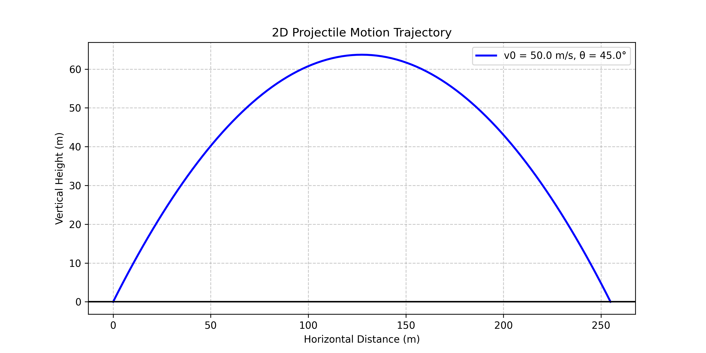
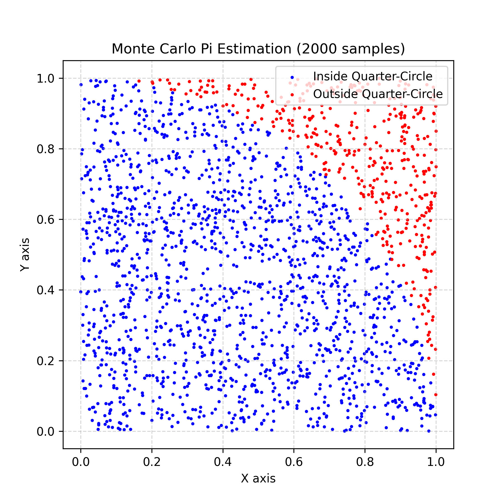
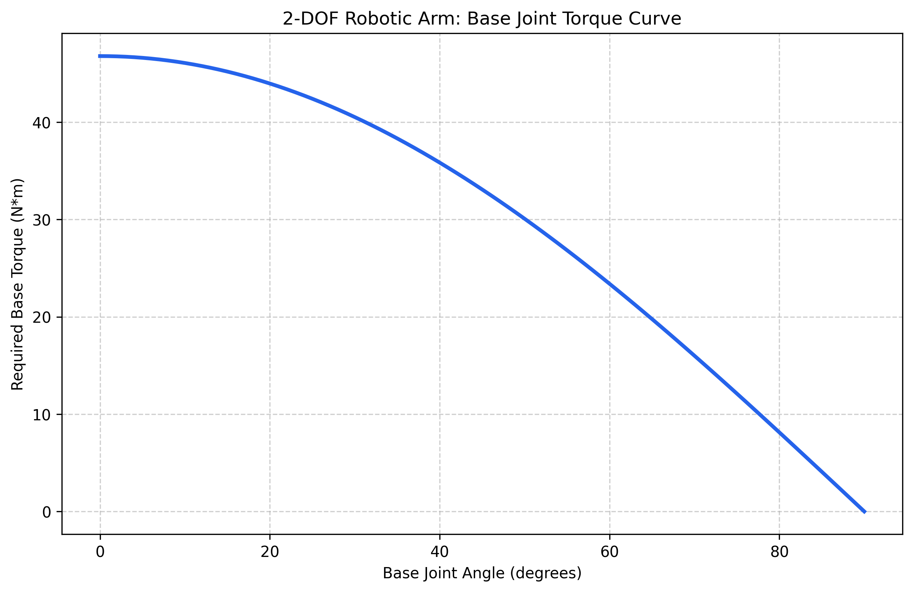

# Python Start

This is a personal Python practice repository. I am preparing to study Engineering Physics, so many of the scripts are small exercises that connect programming with physics, numerical methods, units, and simple robotics ideas.

The goal is not to build a large software project yet. Most files are short programs written to practice:

- basic Python syntax and functions
- using formulas in code
- checking simple input errors
- working with lists, dictionaries, and classes
- plotting results with `matplotlib`
- connecting code with physics and engineering examples

## Repository Structure

### `00_Archive_Basics`

Early Python practice files. These are simple scripts for getting used to variables, functions, printing output, random choices, and basic program flow.

- `hello.py`: First test script.
- `bounding_box.py`: Calculates the area of a simple bounding box.
- `cyber_oracle.py`: Small random-response program using `random` and `time`.

### `01_Numerical_Methods`

Small numerical method examples. These scripts are mainly about using computation to approximate or visualize mathematical ideas.

- `monte_carlo_pi.py`: Estimates pi using random points.
- `plot_monte_carlo.py`: Creates a scatter plot to show the Monte Carlo method visually.

### `02_Computational_Physics`

Physics-related practice scripts. Each file focuses on one formula, model, or engineering calculation.

- `free_fall.py`: Calculates velocity and displacement during ideal free fall.
- `projectile_sim.py`: Computes basic projectile motion values.
- `plot_trajectory.py`: Plots several projectile trajectories.
- `kinetic_energy.py`: Calculates classical kinetic energy.
- `spring_energy.py`: Calculates elastic potential energy in a spring.
- `pendulum_period.py`: Calculates the period of a simple pendulum.
- `planet_weights.py`: Compares weight on different celestial bodies.
- `celestial_body.py`: Uses a simple class to model planets and surface gravity.
- `sensor_data.py`: Simulates noisy sensor readings and applies a moving average.
- `ema_filter.py`: Applies an exponential moving average filter.
- `unit_converter.py`: Converts several common engineering units.
- `aero_drag.py`: Calculates aerodynamic drag force.
- `thermal_expansion.py`: Calculates linear thermal expansion.
- `gear_train_calc.py`: Calculates speed and torque through a compound gear train.
- `rc_circuit_sim.py`: Simulates capacitor charging and discharging in a simple RC circuit.

### `03_Systems_Simulation`

Small simulations using game-like examples. These files are less formal physics models, but they are useful for practicing conditions, loops, dictionaries, and simple rule systems.

- `elden_ring_fall.py`: Uses height thresholds to model fall damage.
- `boss_combat_log.py`: Tracks damage values across several hits.
- `weapon_database.py`: Stores and looks up weapon data with dictionaries.

### `04_Robotics_Simulator`

Basic robotics-related code based on ideas I have encountered through robotics practice and competitions.

- `robot_core.py`: Models a simple two-wheel differential drive robot and updates its position over time.
- `two_dof_arm_torque.py`: Simulates the base joint torque of a 2-DOF robotic arm carrying a 5kg payload.
- `ARCHITECTURE.md`: Notes about the purpose of the robotics simulation folder.

## Requirements

Most scripts only use standard Python. A few plotting and simulation files use:

- `matplotlib`
- `numpy`

Install the extra packages with:

```bash
pip install -r requirements.txt
```

## How to Run

Run any script from the repository root with Python:

```bash
python3 02_Computational_Physics/rc_circuit_sim.py
python3 01_Numerical_Methods/monte_carlo_pi.py
python3 04_Robotics_Simulator/robot_core.py
```

Some files print numerical results in the terminal. Others create plots to make the physics or numerical method easier to see.

## Example Outputs

Some scripts generate plots so the results are easier to understand visually.

### Projectile Trajectory



### Monte Carlo Pi



### 2-DOF Arm Base Torque



## Notes

This repository is mainly a learning record. I expect the code style and structure to improve over time as I learn more Python, physics, and engineering tools.
