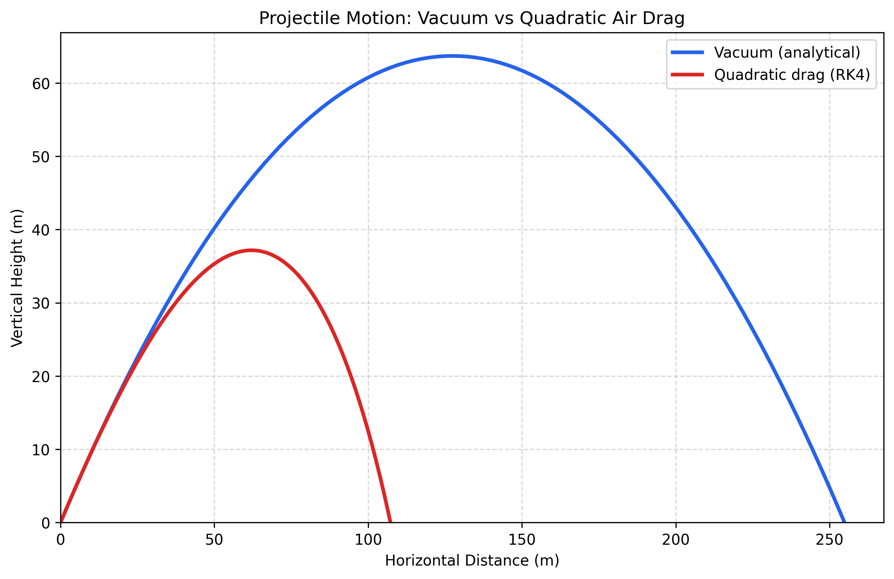
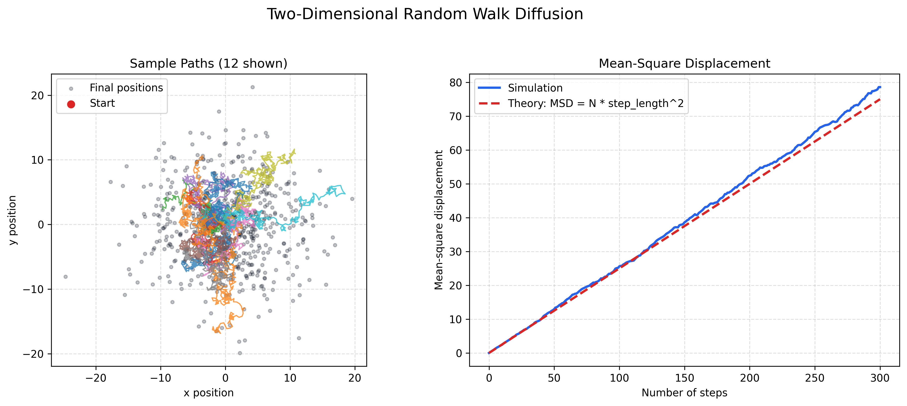
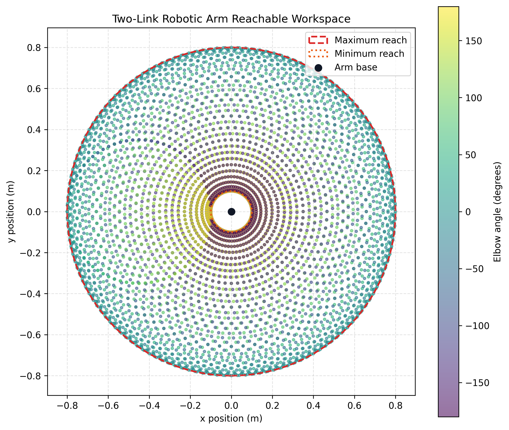
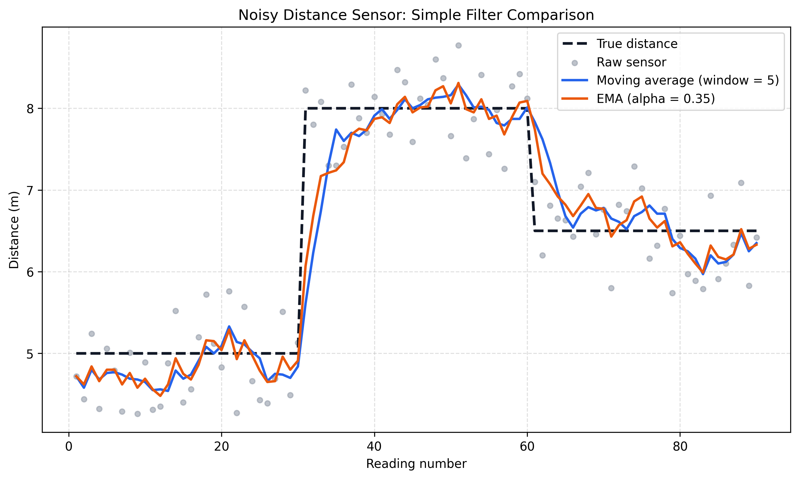
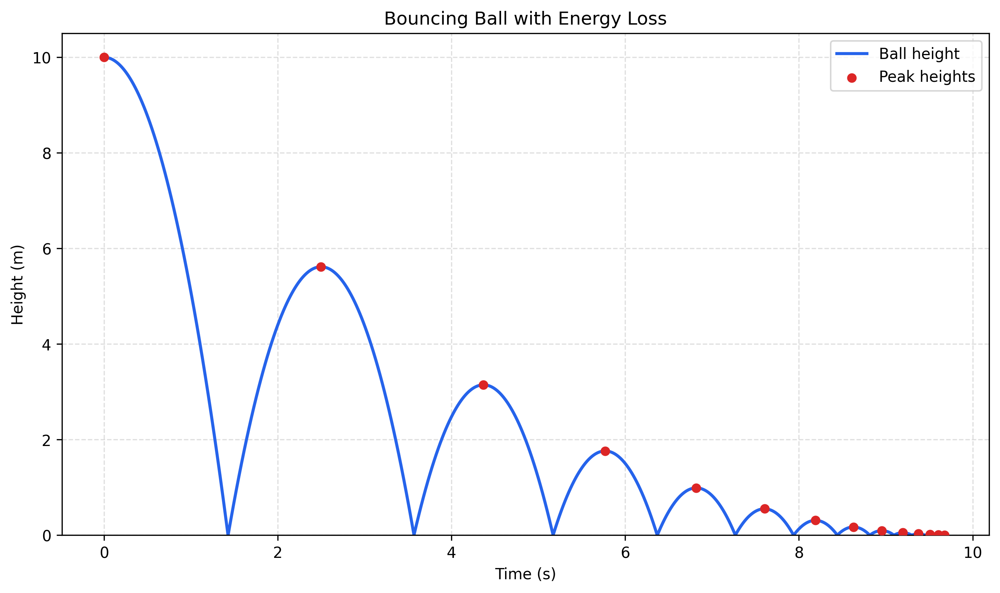

# Python Start

This is a personal Python practice repository. I am preparing to study Engineering Physics, so many of the scripts are small exercises that connect programming with physics, numerical methods, units, and simple robotics ideas.

The goal is not to build a large software project yet. Most files are short programs written to practice:

- basic Python syntax and functions
- using formulas in code
- checking simple input errors
- working with lists, dictionaries, and classes
- plotting results with `matplotlib`
- connecting code with physics and engineering examples

## Repository Structure

### `00_Archive_Basics`

Early Python practice files. These are simple scripts for getting used to variables, functions, printing output, random choices, and basic program flow.

- `hello.py`: Introduces the repository and my Engineering Physics learning direction.
- `bounding_box.py`: Calculates the area of a simple bounding box.
- `cyber_oracle.py`: Small random-response program using `random` and `time`.
- `eighteen_reflection.py`: Short 18th birthday reflection script using variables, a list, and a loop.

### `01_Numerical_Methods`

Small numerical method examples. These scripts are mainly about using computation to approximate or visualize mathematical ideas.

- `monte_carlo_pi.py`: Estimates pi using random points.
- `plot_monte_carlo.py`: Creates a scatter plot to show the Monte Carlo method visually.
- `random_walk_diffusion.py`: Simulates 2D random walks and compares diffusion with theory.

### `02_Computational_Physics`

Physics-related practice scripts. Each file focuses on one formula, model, or engineering calculation.

- `free_fall.py`: Calculates velocity and displacement during ideal free fall.
- `bouncing_ball.py`: Simulates repeated bounces with simple energy loss.
- `projectile_sim.py`: Returns an analytical projectile trajectory without air resistance.
- `projectile_drag.py`: Uses RK4 to simulate projectile motion with quadratic air resistance.
- `compare_projectile_models.py`: Compares the vacuum and air-drag models in a table and plot.
- `plot_trajectory.py`: Plots several ideal projectile trajectories.
- `kinetic_energy.py`: Calculates classical kinetic energy.
- `spring_energy.py`: Calculates elastic potential energy in a spring.
- `pendulum_period.py`: Calculates the period of a simple pendulum.
- `planet_weights.py`: Compares weight on different celestial bodies.
- `celestial_body.py`: Uses a simple class to model planets and surface gravity.
- `sensor_data.py`: Simulates noisy sensor readings and applies a moving average.
- `ema_filter.py`: Applies an exponential moving average filter.
- `compare_sensor_filters.py`: Compares noisy data, a moving average, and an EMA.
- `unit_converter.py`: Converts several common engineering units.
- `aero_drag.py`: Calculates aerodynamic drag force.
- `thermal_expansion.py`: Calculates linear thermal expansion.
- `gear_train_calc.py`: Calculates speed and torque through a compound gear train.
- `rc_circuit_sim.py`: Simulates capacitor charging and discharging in a simple RC circuit.

### `03_Systems_Simulation`

Small simulations using game-like examples. These files are less formal physics models, but they are useful for practicing conditions, loops, dictionaries, and simple rule systems.

- `elden_ring_fall.py`: Uses height thresholds to model fall damage.
- `boss_combat_log.py`: Tracks damage values across several hits.
- `weapon_database.py`: Stores and looks up weapon data with dictionaries.

### `04_Robotics_Simulator`

Basic robotics-related code based on ideas I have encountered through robotics practice and competitions.

- `robot_core.py`: Models a simple two-wheel differential drive robot and updates its position over time.
- `two_dof_arm_torque.py`: Simulates the base joint torque of a 2-DOF robotic arm carrying a 5kg payload.
- `two_link_arm_workspace.py`: Visualizes the reachable area of a two-link planar arm.
- `ARCHITECTURE.md`: Notes about the purpose of the robotics simulation folder.

## Requirements

Most scripts only use standard Python 3. A few plotting files use:

- `matplotlib`

Install the extra packages with:

```bash
pip install -r requirements.txt
```

## How to Run

Run scripts from the repository root with Python so file paths like `assets/` work correctly:

```bash
python3 02_Computational_Physics/rc_circuit_sim.py
python3 02_Computational_Physics/compare_sensor_filters.py
python3 02_Computational_Physics/bouncing_ball.py
python3 01_Numerical_Methods/monte_carlo_pi.py
python3 01_Numerical_Methods/random_walk_diffusion.py
python3 04_Robotics_Simulator/robot_core.py
python3 04_Robotics_Simulator/two_link_arm_workspace.py
```

Some files print numerical results in the terminal. Others create plots to make the physics or numerical method easier to see.

Run all automated checks with:

```bash
python3 -m unittest discover -s tests -v
```

## Random-Walk Diffusion Study

This experiment models diffusion using many independent particles. Each particle starts at the origin and moves a fixed distance in a random direction during every step.

The mean-square displacement (MSD) measures how far the group spreads from its starting point:

```text
MSD = average(x^2 + y^2)
```

For an ideal two-dimensional random walk with step length `l`, the expected relationship is:

```text
MSD = N * l^2
```

Here, `N` is the number of steps. The example uses 600 walkers, 300 steps per walker, a step length of `0.5`, and random seed `42`. The fixed seed makes the learning example reproducible.

Run the experiment from the repository root:

```bash
python3 01_Numerical_Methods/random_walk_diffusion.py
```

The final simulated MSD is `78.58`, compared with the theoretical value `75.00`, giving a relative error of about `4.78%`. The small difference is expected because the simulation uses a finite number of random walkers. Increasing the number of walkers would usually make the simulated curve smoother and closer to the theoretical average.

## Projectile Air-Drag Study

This small study compares two models for a projectile launched from ground level:

- An analytical vacuum model that ignores air resistance.
- A numerical model with quadratic air resistance, solved using the fourth-order Runge-Kutta (RK4) method.

The drag-force vector is modeled as:

```text
F_drag = -0.5 * rho * C_d * A * |v| * v
```

Here, `rho` is air density, `C_d` is the drag coefficient, `A` is cross-sectional area, and `v` is the velocity vector. The negative sign means that drag acts opposite to the direction of motion.

The example uses a roughly baseball-sized projectile. These are simulation parameters rather than measurements from a physical experiment:

- Initial speed: `50.0 m/s`
- Launch angle: `45 degrees`
- Mass: `0.145 kg`
- Drag coefficient: `0.47`
- Cross-sectional area: `0.0042 m^2`
- Air density: `1.225 kg/m^3`
- RK4 time step: `0.01 s`

Run the comparison from the repository root:

```bash
python3 02_Computational_Physics/compare_projectile_models.py
```

The simulation produces these results:

| Model | Flight Time (s) | Maximum Height (m) | Range (m) |
| --- | ---: | ---: | ---: |
| Vacuum | 7.21 | 63.71 | 254.84 |
| Quadratic drag | 5.46 | 37.17 | 107.24 |

For these parameters, air resistance reduces the range by about 58% and the maximum height by about 42%. This illustrates why the ideal vacuum equations can strongly overestimate real projectile motion at higher speeds.

## Two-Link Arm Workspace Study

This example uses forward kinematics to calculate the end-effector position of a planar robotic arm:

```text
x = L1 * cos(theta1) + L2 * cos(theta1 + theta2)
y = L1 * sin(theta1) + L2 * sin(theta1 + theta2)
```

The two link lengths are `0.45 m` and `0.35 m`. Both joints are sampled from `-180` to `180` degrees, producing 5,329 arm configurations. With unrestricted joint rotation, the theoretical reach is between:

```text
minimum reach = |L1 - L2| = 0.10 m
maximum reach =  L1 + L2  = 0.80 m
```

Run the workspace visualization from the repository root:

```bash
python3 04_Robotics_Simulator/two_link_arm_workspace.py
```

The empty center of the plot is physically meaningful: the arm cannot reach closer than the difference between its two link lengths without changing the mechanism.

## Sensor Filter Comparison

This example simulates a distance sensor while a robot moves between three distances from a wall. It compares the raw readings with two simple filters:

- A moving average that averages the latest five readings.
- An exponential moving average (EMA) that gives 35% weight to each new reading.

Run the comparison from the repository root:

```bash
python3 02_Computational_Physics/compare_sensor_filters.py
```

With the fixed example data, the mean absolute error decreases from `0.392 m` for the raw sensor to `0.297 m` for the moving average and `0.289 m` for the EMA. The graph also shows the tradeoff: filtering reduces random noise, but filtered values take longer to follow a sudden distance change.

## Bouncing Ball Simulation

This example drops a ball from `10 m` and updates its velocity and height in small time steps:

```text
velocity = velocity - gravity * dt
height = height + velocity * dt
```

When the ball reaches the ground, its velocity reverses direction and is multiplied by a restitution value of `0.75`. This makes each bounce lower than the previous one. The next peak height is approximately:

```text
next height = current height * restitution^2
```

Run the simulation from the repository root:

```bash
python3 02_Computational_Physics/bouncing_ball.py
```

The example completes 13 visible bounces before the rebound speed becomes very small. Its first rebound reaches about `5.62 m`, close to the theoretical value `10 * 0.75^2 = 5.625 m`.

## Example Outputs

Some scripts generate plots so the results are easier to understand visually.

### Projectile Trajectory


### Projectile Air-Drag Comparison



### Monte Carlo Pi


### Random-Walk Diffusion



### 2-DOF Arm Base Torque


### Two-Link Arm Workspace



### Sensor Filter Comparison



### Bouncing Ball Simulation



## Notes

This repository is mainly a learning record. I expect the code style and structure to improve over time as I learn more Python, physics, and engineering tools.
